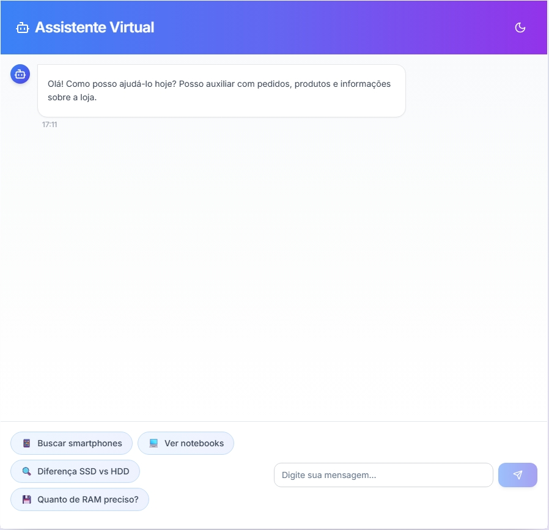
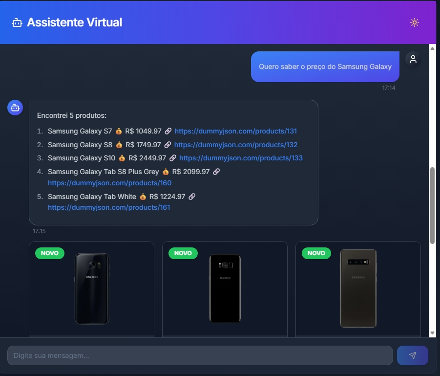
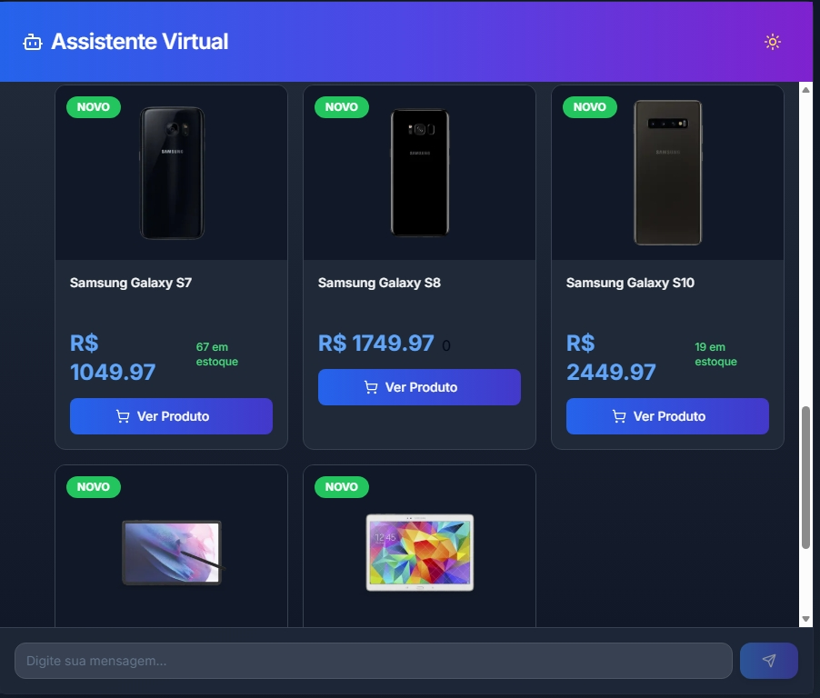
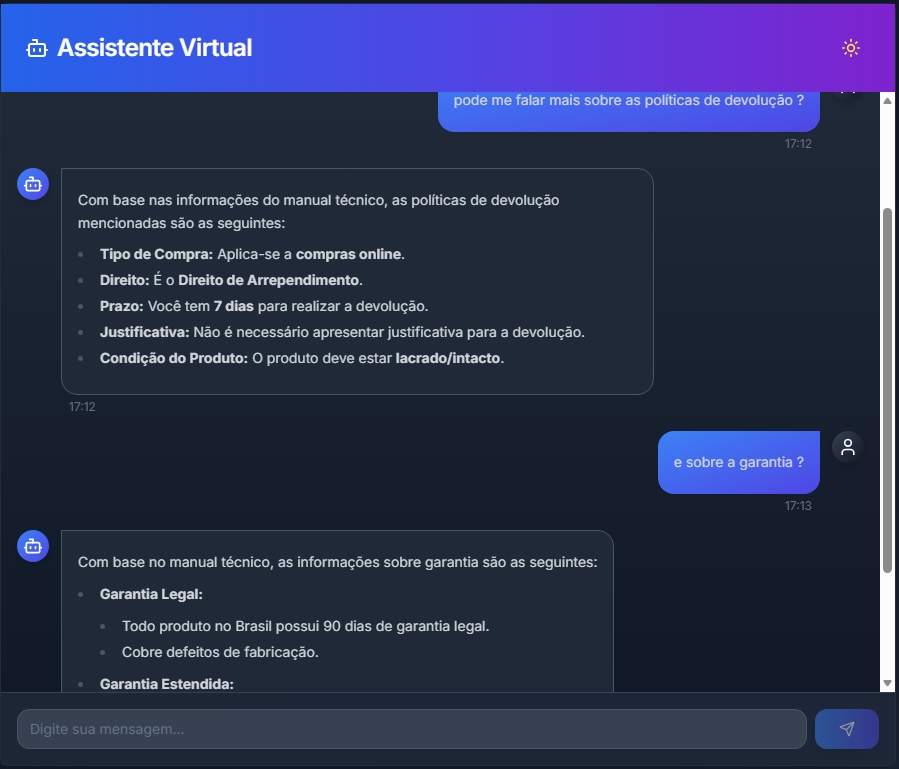

<div align="center">

# 🤖 E-commerce Support Chatbot

### Assistente de atendimento inteligente para e-commerce com IA, RAG e busca de produtos em tempo real

[](https://www.python.org/)
[](https://fastapi.tiangolo.com/)
[](https://nextjs.org/)
[](https://www.typescriptlang.org/)
[](https://ai.google.dev/)
[](https://www.trychroma.com/)
[](https://tailwindcss.com/)

[🚀 Demo](#-demonstração) • [✨ Funcionalidades](#-funcionalidades) • [🛠️ Instalação](#️-instalação) • [📚 Documentação](#-arquitetura)

</div>

---

## 📋 Sobre o Projeto

Um chatbot completo de atendimento ao cliente para e-commerce que combina **Inteligência Artificial**, **RAG (Retrieval Augmented Generation)** e **busca inteligente de produtos**. O sistema é capaz de responder perguntas técnicas consultando uma base de conhecimento, buscar produtos em tempo real e manter conversas naturais com os clientes.

### 🎯 Problema Resolvido

- **Atendimento 24/7** sem necessidade de operadores humanos
- **Respostas técnicas precisas** baseadas em documentação real
- **Busca inteligente de produtos** com compreensão de linguagem natural
- **Experiência moderna** com interface responsiva e dark mode

---

## ✨ Funcionalidades

### 🤖 Inteligência Artificial
- ✅ Chat conversacional com **Google Gemini 2.5 Flash**
- ✅ Temperatura 0.2 para respostas precisas e consistentes
- ✅ Detecção automática de intenção (não apenas keywords)
- ✅ Suporte completo em português

### 📚 RAG (Retrieval Augmented Generation)
- ✅ Base de conhecimento técnico com ChromaDB
- ✅ Busca vetorial semântica para contexto relevante
- ✅ Embeddings multilíngues (paraphrase-multilingual-MiniLM-L12-v2)
- ✅ Respostas baseadas em documentação real

### 🛍️ Busca de Produtos
- ✅ Integração com múltiplas APIs (DummyJSON, FakeStoreAPI)
- ✅ Extração inteligente de parâmetros (produto, preço máximo)
- ✅ Tradução automática PT→EN para melhor busca
- ✅ Conversão de moedas (USD→BRL) em tempo real
- ✅ Fallback para termos genéricos

### 🎨 Interface Moderna
- ✅ Design glassmorphism com animações suaves
- ✅ Dark mode nativo
- ✅ Chips de sugestões interativos
- ✅ Cards de produtos elegantes com imagens
- ✅ Totalmente responsiva (mobile, tablet, desktop)
- ✅ Indicadores de digitação e loading states

---

## 🚀 Tech Stack

<div align="center">

### Backend

| Tecnologia | Descrição |
|------------|-----------|
| **FastAPI** | Framework Python assíncrono para APIs REST |
| **Python 3.10+** | Linguagem principal com type hints |
| **Google Gemini API** | Modelo de IA conversacional (gemini-2.5-flash) |
| **ChromaDB** | Vector database para RAG |
| **Sentence Transformers** | Geração de embeddings multilíngues |
| **HTTPX** | Cliente HTTP assíncrono |

### Frontend

| Tecnologia | Descrição |
|------------|-----------|
| **Next.js 15** | React framework com App Router |
| **TypeScript** | Tipagem estática para JavaScript |
| **Tailwind CSS** | Framework CSS utility-first |
| **Shadcn/ui** | Componentes UI acessíveis |
| **Lucide Icons** | Biblioteca de ícones SVG |

### IA & Machine Learning

| Componente | Função |
|------------|--------|
| **Google Gemini 2.5** | Processamento de linguagem natural |
| **ChromaDB** | Armazenamento e busca vetorial |
| **Sentence-BERT** | Embeddings semânticos |
| **RAG Pipeline** | Recuperação e geração aumentada |

</div>

---

## 📁 Estrutura do Projeto

```
Sistema Novo/
├── backend/
│   ├── main.py                    # API FastAPI principal
│   ├── requirements.txt           # Dependências Python
│   ├── .env.example              # Variáveis de ambiente
│   ├── data/
│   │   ├── manual_tecnico.txt    # Base de conhecimento para RAG
│   │   └── chroma_db/            # Vector database (auto-gerado)
│   └── services/
│       ├── ai_service.py         # Integração com Gemini AI
│       ├── product_service.py    # Integração com APIs públicas
│       └── rag_service.py        # RAG com ChromaDB
│
├── frontend/
│   ├── app/
│   │   ├── layout.tsx            # Layout principal
│   │   ├── page.tsx              # Página inicial
│   │   └── globals.css           # Estilos globais + Tailwind
│   ├── components/
│   │   ├── chat-interface.tsx   # Interface do chat
│   │   ├── product-card.tsx     # Card de produto
│   │   └── ui/                   # Componentes Shadcn
│   ├── package.json
│   └── tsconfig.json
│
└── README.md
```

## 🎯 Arquitetura

<div align="center">

```
┌─────────────┐
│   Cliente   │
│  (Browser)  │
└──────┬──────┘
       │
       ▼
┌─────────────────────┐
│   Next.js Frontend  │
│  • React Components │
│  • Tailwind CSS     │
│  • TypeScript       │
└──────────┬──────────┘
           │
           ▼ (HTTP/REST)
┌────────────────────────────┐
│      FastAPI Backend       │
│ ┌────────────────────────┐ │
│ │    AI Service          │ │
│ │  (Gemini 2.5 Flash)    │ │
│ └────┬─────────────┬─────┘ │
│      │             │        │
│      ▼             ▼        │
│  ┌────────┐   ┌─────────┐  │
│  │  RAG   │   │ Product │  │
│  │Service │   │ Service │  │
│  └───┬────┘   └────┬────┘  │
│      │             │        │
└──────┼─────────────┼────────┘
       │             │
       ▼             ▼
┌────────────┐  ┌──────────┐
│ ChromaDB   │  │ External │
│ (Vectors)  │  │   APIs   │
└────────────┘  └──────────┘
```

</div>

### 🔄 Fluxo de Funcionamento

#### 1. **Detecção de Intenção**
O Gemini analisa a mensagem do usuário e decide:
- **Pergunta técnica?** → Usa RAG (consulta manual técnico)
- **Busca de produto?** → Chama APIs de produtos
- **Conversa normal?** → Resposta conversacional natural

#### 2. **RAG (Retrieval Augmented Generation)**
```
Mensagem do usuário
    ↓
Gera embedding da pergunta
    ↓
Busca vetorial no ChromaDB (top 3 chunks mais similares)
    ↓
Combina contexto + pergunta
    ↓
Gemini gera resposta baseada no contexto
```

#### 3. **Busca de Produtos**
```
"Quero um notebook até R$ 3000"
    ↓
Extrai: produto="notebook", max_price=3000
    ↓
Traduz: "notebook" → "laptop"
    ↓
Busca em APIs (DummyJSON + FakeStore)
    ↓
Converte USD → BRL
    ↓
Retorna produtos formatados
```

---

## 🛠️ Instalação

### Pré-requisitos
- **Python 3.10+**
- **Node.js 18+** e npm/yarn/pnpm
- Conta no **Google AI Studio** (para Gemini API key - gratuita!)

### 1️⃣ Clone o Repositório
```bash
git clone https://github.com/RodrigoAraujo12/ecommerce-chatbot-ai.git
cd ecommerce-chatbot-ai
```

### 2️⃣ Backend (FastAPI)

```bash
# Navegar para a pasta do backend
cd backend

# Criar ambiente virtual (recomendado)
python -m venv venv

# Ativar ambiente virtual
# Windows:
venv\Scripts\activate
# Linux/Mac:
source venv/bin/activate

# Instalar dependências
pip install -r requirements.txt

# Configurar variáveis de ambiente
cp .env.example .env
# Editar .env e adicionar suas API keys

# Rodar o servidor
python main.py
# Ou com uvicorn:
uvicorn main:app --reload
```

Backend rodando em: **http://localhost:8000**

### 2️⃣ Frontend (Next.js)

```bash
# Navegar para a pasta do frontend
cd frontend

# Instalar dependências
npm install
# ou
yarn install
# ou
pnpm install

# Configurar variáveis de ambiente (opcional)
cp .env.example .env.local

# Rodar o servidor de desenvolvimento
npm run dev
# ou
yarn dev
# ou
pnpm dev
```

Frontend rodando em: **http://localhost:3000**

---

## 📸 Demonstração


### Interface Principal


### Busca de Produtos


### Imagens dos Produtos


### RAG


---

## 🔑 Configuração de API Keys

### Google Gemini (Gratuito!)
1. Acesse https://aistudio.google.com/app/apikey
2. Crie uma API key
3. Adicione no `backend/.env`:
```env
GEMINI_API_KEY=your_key_here
```

**Limites do plano gratuito:**
- 20 requisições por minuto
- 1500 requisições por dia
- Suficiente para desenvolvimento e testes!

## 📝 Como Usar

1. **Inicie o backend** (terminal 1):
```bash
cd backend
python main.py
```

2. **Inicie o frontend** (terminal 2):
```bash
cd frontend
npm run dev
```

3. **Acesse** http://localhost:3000

4. **Converse** com o chatbot!

---

## 🎨 Próximas Funcionalidades

- [ ] 🔐 Autenticação de usuários
- [ ] 📊 Dashboard de analytics
- [ ] 💾 Histórico de conversas persistente
- [ ] 🌍 Múltiplos idiomas (internacionalização)
- [ ] 📧 Integração com email para notificações
- [ ] 🎯 Recomendações personalizadas
- [ ] 🤝 Integração com CRMs (HubSpot, Salesforce)
- [ ] 📱 App mobile (React Native)
- [ ] 🧪 Testes unitários e E2E
- [ ] 🚀 Deploy em produção (Vercel + Railway)

---

## 🤝 Contribuindo

Contribuições são bem-vindas! Sinta-se à vontade para:

1. Fork o projeto
2. Crie uma branch (`git checkout -b feature/NovaFuncionalidade`)
3. Commit suas mudanças (`git commit -m 'Adiciona nova funcionalidade'`)
4. Push para a branch (`git push origin feature/NovaFuncionalidade`)
5. Abra um Pull Request

---

## 📄 Licença

Este projeto está sob a licença MIT. Veja o arquivo [LICENSE](LICENSE) para mais detalhes.

---

## 👨‍💻 Autor

**Rodrigo Araújo**

[](https://linkedin.com/in/seu-perfil)
[](https://github.com/RodrigoAraujo12)

---

## ⭐ Apoie o Projeto

Se este projeto foi útil para você, considere dar uma ⭐ no repositório!

---

<div align="center">

**Desenvolvido com ❤️ usando IA**

*Powered by Google Gemini AI*

</div>
